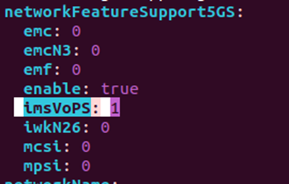


# **IOS MCN v0.1.0 Agartala Release Troubleshooting Guide: SD-Core v0.1**

## Introduction

The guide lists the possible errors and issues facing in the installation and running of SD-Core on the server. There are many networks interfaces and pods for each services on the 5G core solution. The connections, interfaces, pods and other services are covered on the troubleshooting guide.

## Purpose and Audience

This document envisages a developer or user to solve the error or issues may face on the running on the system. The troubleshooting steps rectifies the issues immediately. Also, FAQ covers the common asking questions with instant response.

## Common Troubleshooting
###	Error/Issue 1
-	Issue Title: Data sent error
-	Description: Data could not be sent to remote host
-	Common Solutions: Update ansible.cfg in aether-onramp with following replacement 
 *#pipelining = True*
###	Error/Issue 2:
-	Issue Title: ansible include removed 
-	Description: ansible.builtin.include has been removed
-	Common Solutions: Update the *main.yml* file in *‘deps/folder/roles/folder/tasks’* with the following replacement
Replace all include with import_tasks
 *#include: roles/rke2/tasks/install.yml
import_tasks: roles/rke2/tasks/install.yml*
###	Error/Issue 3
- Issue Title: Asking password for sudo
-	Description: sudo command running without password
-	Common Solutions: Execute the following command on terminal
*$sudo visudo /etc/sudoers
add/update file %sudo ALL=(ALL:ALL) NOPASSWD:ALL*
###	Error/Issue 4: 
-	Issue Title: Cleaning installation
-	Description: Installation is not cleaning
-	Common Solutions: Execute the clean commands
*$ make aether-gnbsim-uninstall
$ make aether-amp-uninstall
$ make aether-5gc-uninstall
$ make aether-k8s-uninstall*
###	Error/Issue 5:
-	Issue Title: Network is not reachable
-	Description: Network service restart after the not reachable response
-	Common Solutions: Restart network manager using the command
 systemctl restart systemd-networkd.service
###	Error/Issue 6
-	Issue Title: Status of k8s
-	Description: To see the k8s node status
-	Common Solutions: The status can be listed using
*$kubectl get nodes
$kubectl describe nodes*
###	Error/Issue 7
-	Issue Title: k8s logs display
-	Description: Getting logs of deployed k8s
-	Common Solutions: Run *$ journalctl -u kubelet*  for seeing the logs
###	Error/Issue 8
-	Issue Title: Events in kubectl
-	Description: Display of kubectl events
-	Common Solutions: *$kubectl get events -n namespace*
### Error/Issue 9
-	Issue Title: No logs from a pod
-	Description: No logs from a container of a pod
-	Common Solutions: Take terminal and run the command
*$kubectl logs -c ‘container’ ‘pod’ -n ‘namespace’*
###	Error/Issue 10
-	Issue Title: Container has no response
-	Description: verify the response by getting all containers in a pod
-	Common Solutions: *$kubectl describe pod ‘podname’ -n ‘namespace’*
###	Error/Issue 11
-	Issue Title: Pod status
-	Description: Verify the status of pod
-	Common Solutions: Execute the following command and observe results.
*$kubectl -n omec get pods	
$kubectl get pods --all-namespaces -o wide (Displays IP address details also)
$kubectl -n aether-roc get pods	
$kubectl logs pod-name -n omec (To get logs from a pod)*
###	Error/Issue 12
-	Issue Title: Service Ip status
-	Description: verification of service IP
-	Common Solutions: Execute the commads and observe IP
*$kubectl get svc -n omec -o wide
$kubectl get svc --all-namespaces -o wide*
###	Error/Issue 13
-	Issue Title: Pod to Pod not reachable
-	Description: ping pod to pod
-	Common Solutions: *$kubectl exec -ti pod-name -n omec -- ping 192.168.85.216*
###	Error/Issue 14
-	Issue Title: Pod not responding
-	Description: Restart the pod
-	Common Solutions: Run the command on terminal
*$kubectl delete pod <pod-name> -n omec*
###	Error/Issue 15
-	Issue Title: Edit pod
-	Description: Verify and update pod configuration
-	Common Solutions: User the command *$kubectl edit* *configmap -n omec <pod>, for eg. $kubectl edit configmap -n omec amf*
###	Error/Issue 16
-	Issue Title: IMS service not available
-	Description: IMS Enable in AMF Pod
-	Common Solutions: Update the config as per the following instruction
*$kubectl edit configmap -n omec amf*
In networkFeatureSupport5GS, Change IMSVoPS From 0 to 1 as shown below
 

 
###	Error/Issue 17
-	Issue Title: Pod status is not updating
-	Description: To get kubernetes pod status in every one second
-	Common Solutions: Run the command to get status periodically
*$ watch n1 kubectl get pods -n omec*
###	Error/Issue 18
-	Issue Title: Access UPF pod
-	Description: Get inside UPF pod
-	Common Solutions: Access the pod with the command
 *$ kubectl exec it upf-0 -n omec -- bin/bash*
###	Error/Issue 19
-	Issue Title: check network namespaces
-	Description: To get namespace of network
-	Common Solutions: execute $ sudo ip netns list
###	Error/Issue 20
-	Issue Title: MAC address of Access and Core
-	Description: Set Mac address of access and core outside the UPF Pod
-	Common Solutions: Find the IP address and set <macaddress> using the following command
*$ sudo arp s 192.168.252.3 <macaddress>
$ sudo arp -s 192.168.250.3 <macaddress>* 
###	Error/Issue 21
-	Issue Title: UPF packet Capture
-	Description: Packet capture inside upf pod
-	Common Solutions: Execute the commands
*$ tcpdump accessFastBPF in 0 -ne w packet.pcap
$ kubectl cp omec/upf-0:/opt/bess/bessctl/packet.pcap* /home/cssuser/packet.pcap
###	Error/Issue 22
-	Issue Title: Pod status not updating
-	Description: Get pod status every 1 second
-	Common Solutions: Use command on terminal 
 *$ watch -n1 kubectl get pods -n omec*
###	Error/Issue 23
-	Issue Title: Pod deletes error
-	Description: Force to delete pod
-	Common Solutions:  Delete Pod forcefully
*$ kubectl delete pod n omec <podname> --force –grace-period=0*
###	Error/Issue 24
-	Issue Title: Interface creation
-	Description:  Create Virtual Iface for Iperf
-	Common Solutions:
*sudo ip link add link <iface>  ipfdld type macvlan
sudo ip link set ipfdld up
sudo ip addr add 192.162.45.45 dev ipfdld*
###	Error/Issue 25
-	Issue Title: set rx and tx value
-	Description: To set rx and tx value
-	Common Solutions: *$ sudo ethtool -G <interface_name> rx 4096 tx 4096*
###	Error/Issue 26
-	Issue Title: previous pod log 
-	Description: Check previous pod log
-	Common Solutions: *$ kubectl logs <pod-name> --previous -n omec*
###	Error/Issue 27
-	Issue Title: Lists all the network namespaces
-	Description: Lists all the network namespaces
-	Common Solutions: 
*$ sudo ip netns list
$ sudo ip netns exec <namespace> ip link  
$ sudo ip netns delete <namespace>*
###	Error/Issue 28
-	Issue Title: Invalid Network Namespaces
-	Description:  Remove Invalid Network Namespaces
-	Common Solutions: 
*for ns in $(ls /var/run/netns); do
    sudo ip netns delete $ns
done*
###	Error/Issue 29
-	Issue Title:  List all namespaces and IP link information
-	Description: List all namespaces and IP link information
-	Common Solutions: 
*namespaces=$(sudo ip netns list | awk '{print $1}')
for ns in $namespaces; do
  echo "Namespace: $ns"
  sudo ip -n $ns link
  echo ""
done*
###	Error/Issue 30
-	Issue Title: MTU of a network interface
-	Description: Set the MTU of a network interface
-	Common Solutions: 
*$ sudo ip link set dev <interface> mtu 1460*

##	Frequently Asked Questions
###	What is the minimum hardware requirement for installing SD-Core?
The core software requires at least 4 CPU cores and 16GB RAM memory to installation.
### Provide the port numbers and URL for accessing the management interface
The application uses port number 31194 and 30950. It can verify using the following URLs
*http://<server_ip>:<port_number >* 
###	How to view the status of a pod?
Take a terminal and input the command, 
*kubectl -n omec get pods*
This command will return the status of pods
###	My pod is not responding for a long time. How can I restart a pod?
Use the command 
*kubectl delete pod <pod-name> -n omec*
to restart the pod again
###	How to list all network namespaces in SD-Core installed system?
The following command lists all namespaces
*sudo ip netns list*

## Related Artifacts & links

| **Document Name** | **Purpose** | **Link** |
|--|--|--|
| Installation Guide | Installation of SD-Core | [Click here](./Installation%20Guide.md) |
| Developer Guide | Guide for SD-Core developers | [Click Here](./Developer%20Guide.md)|
| User Guide | Quick user guide | [Click Here](./User%20Guide.md)  |
| API Guide | API guide | [Click here](./API%20Guide.md)|
| Troubleshooting Guide  | Troubleshooting guide for SD-Core | [Click here](./Troubleshooting%20Guide.md)|
